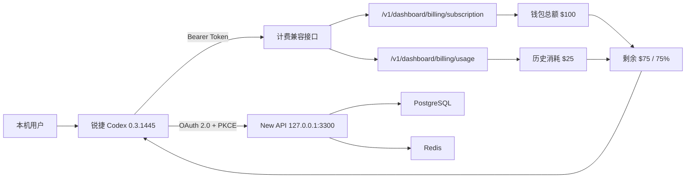

# 锐捷 Codex × New API 本机计费联调验收

## 一句话结论

本机联调闭环已经完成：New API 通过 Docker 持续运行，锐捷 Codex `0.3.1445` 使用 OAuth 令牌读取服务端真实钱包数据，并在个人菜单、用量弹窗、设置页三处一致显示“已用 $25 / 总额 $100 / 剩余 $75（75%）”。

这只是本机集成验收，不等同于生产上线。当前 New API 还没有配置可用的上游模型渠道，公网 HTTPS、生产域名、桌面端正式签名/公证和妙搭免手输令牌也尚未完成。

## 联调架构



## 验收结果

| 验收项 | 实测结果 | 状态 |
|---|---:|---|
| New API | `http://127.0.0.1:3300`，容器运行中 | 通过 |
| PostgreSQL | `new-api-local-pg`，健康检查为 `healthy` | 通过 |
| Redis | `new-api-local-redis`，容器运行中 | 通过 |
| OAuth 登录 | OAuth 2.0 + PKCE，桌面端可取得并保存令牌 | 通过 |
| 账户总额度 | `$100` | 通过 |
| 历史消耗 | `$25` | 通过 |
| 剩余额度 | `$75` | 通过 |
| 剩余比例 | `75%` | 通过 |
| 个人菜单 | 显示“账户余额 75%” | 通过 |
| 用量弹窗 | 显示“账户余额 用量限制，剩余 75%” | 通过 |
| 设置页 | 显示“账户额度，剩余 75%” | 通过 |
| 了解更多 | 指向 `http://127.0.0.1:3300/console` | 通过 |
| 自动测试 | `tests/ruizhi-platform-usage.test.mjs`，8/8 通过 | 通过 |
| 全量测试基线 | 117 项中 100 通过、17 个既有失败；主要因未生成 Windows `overrides/windows-app/asar` 夹具及旧页面增强断言 | 未新增失败 |
| macOS 构建 | ZIP、DMG、更新清单均成功生成 | 通过 |

## 界面证据

### 个人菜单


### 用量弹窗


### 使用情况和计费设置页


## 安装与运行

### 启动本机 New API

在 `new-api` 仓库执行：

```bash
make local-up
```

本机入口：

- 服务首页：`http://127.0.0.1:3300`
- 控制台：`http://127.0.0.1:3300/console`

管理员密码保存在 macOS 钥匙串中，不写入仓库、镜像、日志或本文档。

### 安装本机测试版锐捷 Codex

安装包：

```text
dist/Ruizhi-macos-0.3.1445-arm64.dmg
```

本机已经额外安装一份不覆盖现有正式 App 的测试副本：

```text
/Applications/锐捷Codex本机测试.app
```

桌面一键入口：

```text
/Users/zhangteng/Desktop/启动锐捷Codex本机测试.command
```

入口使用独立的 `RUIZHI_HOME` 和 Electron 用户目录，避免污染现有锐捷 Codex 的账号和配置；本地 OAuth 凭据只保存在当前 Mac，权限已限制为当前用户可读。

该包通过构建参数固定连接本机地址：

```text
RUIZHI_BUILD_API_BASE_URL=http://127.0.0.1:3300/v1
RUIZHI_BUILD_PROVIDER_BASE_URL=http://127.0.0.1:3300/v1
RUIZHI_BUILD_CHATGPT_LOGIN_BASE_URL=http://127.0.0.1:3300
```

因此它只适合本机验收，不能发给其他人的电脑直接使用。

## 本次关键修复

1. 桌面端优先读取锐捷模型平台用量，OpenAI 原生 `/wham/usage` 只作为兼容回退。
2. 把 New API 的钱包余额映射为 Codex 原生用量组件，但不伪造“每月重置时间”。
3. `apikey`、自定义 OAuth 等已登录方式均可显示用量入口，不再只放行 OpenAI 官方账号。
4. macOS 与 Windows 构建脚本共享同一套 API、模型供应商和 OAuth 服务地址覆盖规则。
5. “了解更多”和账户设置链接跟随实际后端地址，不再跳回 OpenAI 官方计费页面。
6. 构建下载增加重试、DMG 校验和损坏临时文件清理，降低重复打包失败概率。

## 尚未完成的生产门槛

| 项目 | 当前状态 | 生产要求 |
|---|---|---|
| 上游模型渠道 | 未配置 | 在 New API 配置并实测模型渠道、倍率和故障回退 |
| 生产部署 | 未部署 | 公网或内网可达的 HTTPS 域名、数据库备份、Redis 持久化、监控告警 |
| 身份体系 | 本机 OAuth 已通 | 确认企业账号映射、令牌撤销、会话过期和用户禁用行为 |
| 真实计费 | 钱包余额接口已通 | 用实际模型请求验证扣费、并发一致性、退款/补偿和账单对账 |
| 妙搭 | 未接入 | 使用受控后端代理或 OAuth，不在前端保存管理员密钥 |
| macOS 发布 | 本机临时签名 | Developer ID 签名、公证、自动更新和回滚 |
| Windows 发布 | 代码已同步，未在 Windows 构建验收 | Windows 签名、安装/升级/卸载及真实机器回归 |

## 下一步建议

1. 先在本机 New API 配置一个受控的测试模型渠道，完成“一次真实对话 → New API 扣费 → Codex 三处余额同步下降”的闭环。
2. 再选择生产部署位置并配置正式域名、HTTPS、数据库备份和密钥管理。
3. 生产后端稳定后，按正式域名重新构建、签名并发布 macOS/Windows 安装包。
4. 最后接妙搭，复用同一身份和用量接口，避免出现两套账号、两套余额口径。
