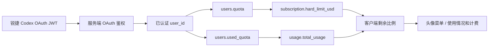

# 锐捷 Codex 用量接口联调说明

## 一句话结论

服务端根因不是“没传真实值”，而是 OAuth access token 的数字 ID 被误当成普通 API Token ID；当两张表的 ID 碰撞时，接口会返回无关 Token 的额度。服务端和客户端已完成本地修正，需部署服务端并重打客户端后才能做生产验收。

## 最终数据链路



## 接口契约

| 接口 | 服务端数据源 | 客户端用途 |
|---|---|---|
| `GET /v1/dashboard/billing/subscription` | `(quota + used_quota) / quota_per_unit` | 总额度 |
| `GET /v1/dashboard/billing/usage` | `used_quota / quota_per_unit * 100` | 历史已用，兼容字段单位为美分 |

客户端换算：

```text
used_usd = total_usage / 100
remaining_usd = hard_limit_usd - used_usd
remaining_percent = remaining_usd / hard_limit_usd * 100
```

钱包额度没有月度重置语义，因此客户端传给 Codex 原生界面的是：

```json
{
  "primary_window": {
    "used_percent": 0,
    "limit_window_seconds": null,
    "reset_at": null
  }
}
```

`used_percent` 为运行时计算值，示例中的 `0` 不是默认额度。

## 已完成修正

| 项目 | 修正内容 |
|---|---|
| 服务端鉴权 | OAuth 和 API Token 显式分类，JWT 不再查普通 `tokens` 表 |
| 服务端额度 | OAuth 始终按用户 ID 读钱包 |
| 服务端扣费 | OAuth 不再读写同 ID 的普通 Token |
| 客户端展示 | 去掉虚构的 30 天窗口和下月 1 日重置 |
| 测试 | 增加 ID 碰撞、完整 HTTP 路由、Token 扣费和 SQL 查询边界回归 |

## 验收标准

| 验收项 | 通过标准 |
|---|---|
| 身份一致 | OAuth 用户与网页当前用户一致 |
| 余额一致 | 桌面端与网页当前余额误差不超过 `$0.01` |
| 历史消耗一致 | `total_usage / 100` 与网页误差不超过 `$0.01` |
| 非占位值 | 不再固定显示 `$5 / $0 / 100%` |
| 账号隔离 | 两个 OAuth 用户的额度互不串号 |
| 时间口径 | 不显示“每月”或伪造重置日 |
| 实时性 | 产生一次模型消费后，网页和桌面端刷新后同步变化 |

## 当前状态

| 环节 | 状态 |
|---|---|
| 服务端本地修复 | 完成 |
| 服务端全量后端测试 | 通过 |
| 客户端用量适配测试 | 5/5 通过 |
| 生产服务端部署 | 未执行 |
| macOS / Windows 重新打包 | 未执行 |
| 真实账号最终验收 | 待部署后执行 |
