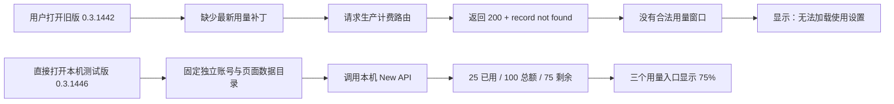

# 锐捷 Codex“无法加载使用设置”修复报告

> 一句话结论：截图中的报错来自旧版生产 App 与未部署真实钱包映射的生产服务；本机测试版 `0.3.1446` 已隔离正式账号目录，并在直接启动场景下正确显示 `$25 / $100 / $75` 与“剩余 75%”。

## 1. 问题与结论

用户在“设置 → 使用情况和计费”看到：

```text
无法加载使用设置。
```

排查后确认不是用量页面组件损坏，而是两层问题叠加：

1. 当时运行的是 `/Applications/锐捷Codex.app` `0.3.1442`，其 `app.asar` 不包含最新的用量桥接、钱包展示、全认证方式放行及自定义 API 主机信任补丁。
2. 生产环境 `https://gptauth.ruijie.com.cn` 的两个计费路由虽然存在，但当前返回 HTTP 200 的错误对象 `record not found`，没有把 OAuth 用户映射到真实钱包额度。

## 2. 证据对比

| 检查项 | 旧生产 App | 本机测试 App 0.3.1446 | 结论 |
|---|---|---|---|
| 安装路径 | `/Applications/锐捷Codex.app` | `/Applications/锐捷Codex本机测试.app` | 两者不是同一个程序 |
| 账号目录 | `~/.ruizhi` | `~/.ruizhi-local-qa-final` | 测试账号已隔离 |
| Electron 数据目录 | `Application Support/Ruizhi` | `Application Support/锐捷Codex本机测试Final` | 不再复用正式版页面状态 |
| 用量桥接 | `模型平台累计用量无效` | `used=25, limit=100, remaining=75` | 本地真实接口可用 |
| 设置页 | `无法加载使用设置` | `账户额度 / 剩余 75%` | 页面恢复 |
| 头像菜单 | 无有效额度 | `账户余额 75%` | 菜单恢复 |
| 用量弹窗 | 无有效额度 | `账户余额 用量限制 / 剩余 75%` | 弹窗恢复 |
| 了解更多 | 生产地址 | `http://127.0.0.1:3300/console` | 测试包指向本机 New API |

## 3. 故障链路



## 4. 本次代码修复

### macOS 与 Windows 构建器

新增两个构建参数：

| 构建参数 | 作用 | 本机测试值 |
|---|---|---|
| `RUIZHI_BUILD_HOME_DIR_NAME` | 固定账号与 Codex 配置目录 | `.ruizhi-local-qa-final` |
| `RUIZHI_BUILD_ELECTRON_USER_DATA_DIR_NAME` | 固定 Electron 页面数据目录 | `锐捷Codex本机测试Final` |

构建器会拒绝空目录名、绝对路径、`.`、`..`、路径分隔符和空字符，避免构建参数逃逸到非预期目录。

Windows 构建器同时把覆盖后的运行时目录配置传入 `app.asar` 元数据刷新，确保 Windows 安装包与 macOS 行为一致。

### 回归测试

新增测试 `local desktop packages isolate account and user data when launched directly`，覆盖两个平台构建脚本，防止后续测试包再次复用生产目录。

## 5. 实机验收

### 5.1 用量弹窗


### 5.2 设置页


### 5.3 验收结果

| 验收项 | 结果 |
|---|---:|
| macOS 0.3.1446 构建 | 通过 |
| App 深度签名校验 | 通过 |
| 不设置环境变量直接启动 | 通过 |
| `/usage/platform` 真实值 | `$25 / $100 / $75` |
| 头像菜单剩余用量 | 通过，75% |
| 用量弹窗 | 通过，75% |
| 设置页 | 通过，75% |
| “了解更多”地址 | 通过，本机控制台 |
| 定向用量测试 | 9/9 通过 |
| 完整仓库测试 | 101/118 通过；17 项为原有失败 |
| `git diff --check` | 通过 |
| 构建脚本语法检查 | 通过 |

## 6. 产物

| 产物 | 路径 |
|---|---|
| 已安装测试 App | `/Applications/锐捷Codex本机测试.app` |
| macOS DMG | `dist/Ruizhi-macos-0.3.1446-arm64.dmg` |
| macOS ZIP | `dist/Ruizhi-macos-0.3.1446-arm64.zip` |

## 7. 生产上线边界与行动建议

本机测试通过不等于生产已经恢复。要让正式 `/Applications/锐捷Codex.app` 显示真实额度，还必须完成以下两项：

1. 把 New API 中 OAuth 用户到钱包额度的服务端改动部署到 `gptauth.ruijie.com.cn`，并用真实生产账号验证两个 billing 路由不再返回 `record not found`。
2. 使用生产 API 地址重新构建并发布锐捷 Codex，新版本必须包含本报告验证过的用量桥接和目录隔离逻辑。

生产验收门槛应固定为：同一真实用户在模型平台与锐捷 Codex 中看到相同余额，且头像菜单、用量弹窗、设置页三处一致。
