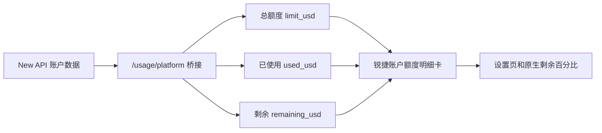

# 锐捷 Codex 账户额度明细修复报告

> 一句话结论：`0.3.1447` 隔离测试版已能在“使用情况和计费”中显示总额度、已使用、剩余余额和使用比例；当前截图中的 `$100 / $25 / $75` 来自本机 New API 测试账户，不代表生产账号余额。

## 1. 为什么以前只能看到百分比

服务端桥接层已经返回精确金额，但原生 Codex 页面只接收了限额百分比；同时，原生余额组件受 ChatGPT 套餐字段控制，锐捷 API Key 账号没有这些字段，因此页面只剩下“剩余 75%”。

第一次实现还发现一个独立问题：项目配置关闭了可选页面增强，余额明细误绑在同一开关上。现在余额明细已作为核心账户能力独立安装，不会重新开启其他页面增强功能。

| 数据层 | 修复前 | 修复后 |
|---|---|---|
| New API / 锐鉴平台 | 已有总额、已用、余额 | 不变 |
| 桌面桥接层 | 返回 `limit_usd / used_usd / remaining_usd` | 不变 |
| 原生 Codex 用量模型 | 只消费百分比，套餐门禁拦住余额组件 | 保留原生百分比 |
| 锐捷明细卡 | 不存在 | 独立读取桥接元数据并展示精确金额 |

## 2. 本机验收结果

| 检查入口 | 实测结果 | 状态 |
|---|---:|---|
| 设置 → 使用情况和计费 → 总额度 | `$100.00` | 通过 |
| 设置 → 使用情况和计费 → 已使用 | `$25.00` | 通过 |
| 设置 → 使用情况和计费 → 剩余余额 | `$75.00` | 通过 |
| 设置 → 使用情况和计费 → 使用比例 | `25%` | 通过 |
| 头像菜单 | “剩余用量”“使用情况”均存在 | 通过 |
| 用量弹窗 | `剩余 75%` | 通过 |
| 桥接层读回 | `100 / 25 / 75`，与页面一致 | 通过 |

## 3. 验证与交付物

| 项目 | 结果 |
|---|---|
| 用量专项测试 | 12/12 通过 |
| macOS 实包构建 | 通过 |
| 安装后签名校验 | 通过 |
| 真实桌面路径验收 | 通过 |
| 全仓测试 | 121 项中 104 通过、17 项原有基线失败；本次未新增失败 |
| Windows | 打包路径与回归测试已同步；本轮未在 Windows 真机生成安装包 |

- macOS DMG：`dist/Ruizhi-macos-0.3.1447-arm64.dmg`
- SHA-256：`76f38141294c57310db057167c62c1b57d571623ef47624389f5b5bb499b2a81`
- 本机安装：`/Applications/锐捷Codex本机测试.app`

## 4. 生产使用前仍需完成

1. 生产 `gptauth.ruijie.com.cn` 的账户接口必须对当前登录身份返回真实的总额度、已使用和剩余余额。
2. 用生产地址重新构建正式版，并用真实用户做一次金额对账。
3. 真实值应以服务端账本为准；客户端只展示，不在本地推测或伪造套餐。

如果生产接口只返回余额、没有总额和已用，客户端无法可靠还原截图中的完整三项数据，必须先补齐服务端合同。
